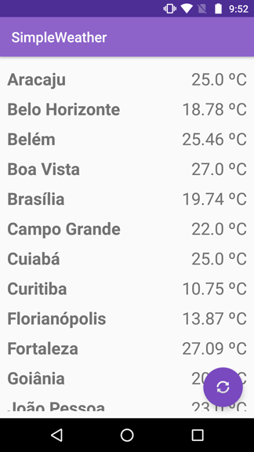

# SimpleWeather
Android app with current temperature of all Brazilians capitals.

## About
The application shows the current temperature of all Brazilians capitals. The temperature it's obtained from OpenWeather API.

## Features
- Retrofit 2.9.0
- Timber 4.7.1
- Butter Knife 10.2.1
- OpenWeather APIs

## Configuration
The application get the cities from the json file "cities.json" located in the "assets" folder. 
The identification in this file is found in the OpenWeather API docs.

## Screenshots

## License
SimpleWeather is an open source project by Davi Barros Pires that is licensed under [MIT](https://opensource.org/licenses/MIT).

## Contact
If you like this project, let me know. 
Davi Barros Pires <contact@davibarros.com>